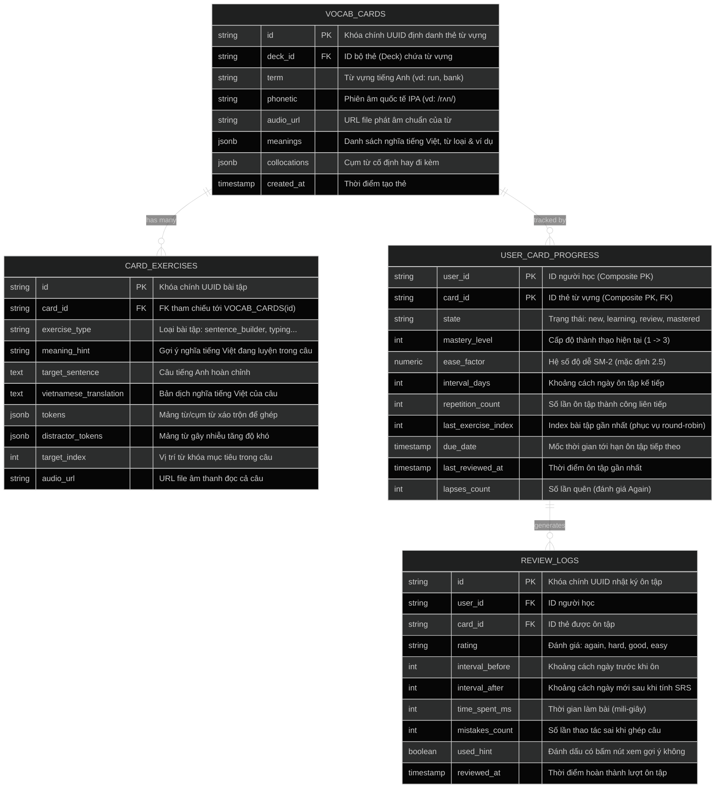
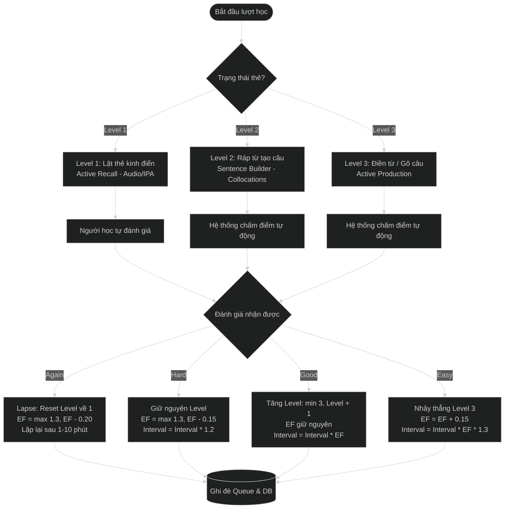
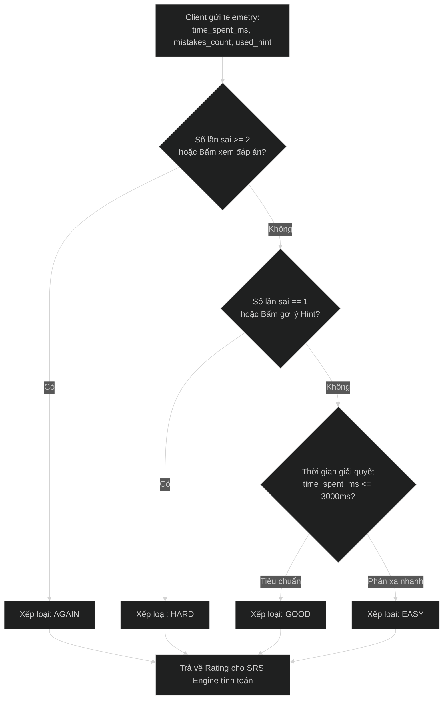
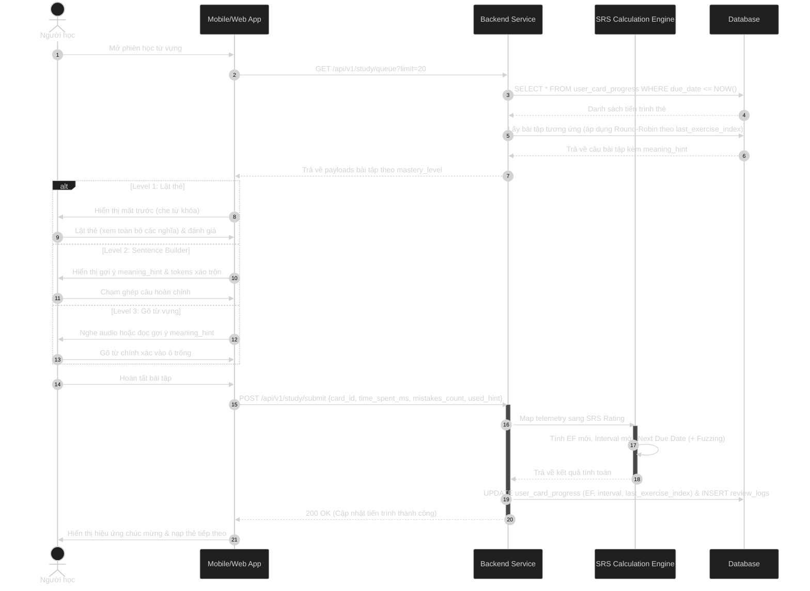

# Đặc Tả Kiến Trúc SRS Flashcard & Bài Tập Ghép Câu

## 1. Sơ Đồ Thực Thể Cơ Sở Dữ Liệu (ERD)



### 1.1. Từ Điển Dữ Liệu Chi Tiết (Data Dictionary)

#### Bảng `VOCAB_CARDS` (Thẻ từ vựng)
| Tên Cột | Kiểu Dữ Liệu | Ràng Buộc | Ý Nghĩa / Mục Đích Sử Dụng |
| :--- | :--- | :--- | :--- |
| `id` | `VARCHAR(36)` | PK | Khóa chính UUID định danh duy nhất cho mỗi thẻ từ vựng. |
| `deck_id` | `VARCHAR(36)` | FK | Khóa ngoại trỏ đến bộ thẻ (`DECKS`), giúp phân loại theo chủ đề/giáo trình. |
| `term` | `VARCHAR(100)` | NOT NULL | Từ vựng hoặc cụm từ tiếng Anh gốc (ví dụ: `"run"`, `"take off"`). |
| `phonetic` | `VARCHAR(100)` | NULL | Ký hiệu phiên âm quốc tế IPA chuẩn (ví dụ: `"/rʌn/"`). |
| `audio_url` | `VARCHAR(255)` | NULL | Đường dẫn URL file âm thanh phát âm chuẩn bản ngữ của từ. |
| `meanings` | `JSONB` | NOT NULL | Mảng JSON lưu trữ danh sách các nghĩa tiếng Việt (được đánh số), từ loại tương ứng, định nghĩa tiếng Anh và câu ví dụ minh họa từng nghĩa. |
| `collocations` | `JSONB` | NULL | Mảng các cụm từ kết hợp tự nhiên (collocations) thường gặp đi kèm với từ vựng. |
| `created_at` | `TIMESTAMPTZ` | DEFAULT NOW() | Thời điểm thẻ từ vựng được khởi tạo trong cơ sở dữ liệu. |

#### Bảng `CARD_EXERCISES` (Bài tập câu luyện tập)
| Tên Cột | Kiểu Dữ Liệu | Ràng Buộc | Ý Nghĩa / Mục Đích Sử Dụng |
| :--- | :--- | :--- | :--- |
| `id` | `VARCHAR(36)` | PK | Khóa chính UUID định danh duy nhất cho bài tập câu. |
| `card_id` | `VARCHAR(36)` | FK | Khóa ngoại liên kết tới thẻ từ vựng mục tiêu trong `VOCAB_CARDS`. |
| `exercise_type` | `VARCHAR(50)` | NOT NULL | Loại bài tập luyện tập (`sentence_builder`: ghép câu, `typing`: gõ từ khuyết...). |
| `meaning_hint` | `VARCHAR(255)` | NULL | Gợi ý nghĩa tiếng Việt đang được rèn luyện trong ngữ cảnh câu này (ví dụ: `"vận hành, quản lý"`). |
| `target_sentence` | `TEXT` | NOT NULL | Câu tiếng Anh hoàn chỉnh, chuẩn ngữ pháp dùng làm bài tập. |
| `vietnamese_translation` | `TEXT` | NOT NULL | Bản dịch tiếng Việt tự nhiên và chuẩn xác của `target_sentence`. |
| `tokens` | `JSONB` | NOT NULL | Mảng các token (từ/cụm từ) được xáo trộn ngẫu nhiên để người học chọn ghép. |
| `distractor_tokens` | `JSONB` | NULL | Mảng các từ gây nhiễu không có trong câu, bổ sung để tăng độ khó khi ghép câu. |
| `target_index` | `INT` | NOT NULL | Vị trí chỉ mục (0-indexed) của từ vựng mục tiêu trong mảng từ của câu gốc. |
| `audio_url` | `VARCHAR(255)` | NULL | Đường dẫn file âm thanh đọc toàn bộ câu văn mẫu để luyện nghe. |

#### Bảng `USER_CARD_PROGRESS` (Tiến trình học SRS theo người dùng)
| Tên Cột | Kiểu Dữ Liệu | Ràng Buộc | Ý Nghĩa / Mục Đích Sử Dụng |
| :--- | :--- | :--- | :--- |
| `user_id` | `VARCHAR(36)` | PK (Composite) | Khóa chính kết hợp, định danh người học. |
| `card_id` | `VARCHAR(36)` | PK (Composite), FK | Khóa chính kết hợp, tham chiếu tới `VOCAB_CARDS(id)`. |
| `state` | `VARCHAR(20)` | DEFAULT 'new' | Trạng thái ghi nhớ của thẻ (`new`: thẻ mới, `learning`: đang học, `review`: đang ôn tập, `mastered`: đã thành thạo). |
| `mastery_level` | `INT` | DEFAULT 1 | Cấp độ thành thạo tương tác (Level 1: lật thẻ, Level 2: ghép câu, Level 3: gõ từ). |
| `ease_factor` | `NUMERIC(4,2)` | DEFAULT 2.50 | Hệ số độ dễ (Ease Factor trong SM-2), dùng nhân với interval để tính chu kỳ giãn cách tiếp theo (tối thiểu 1.30). |
| `interval_days` | `INT` | DEFAULT 0 | Số ngày giãn cách cho lần ôn tập tiếp theo (0: ôn trong ngày, 1: ngày mai, 3: sau 3 ngày...). |
| `repetition_count` | `INT` | DEFAULT 0 | Số lần liên tiếp người học ôn tập đạt đánh giá tốt (`Good` hoặc `Easy`). |
| `last_exercise_index` | `INT` | DEFAULT 0 | Lưu chỉ số câu bài tập đã làm ở lượt gần nhất, phục vụ thuật toán xoay vòng (round-robin) qua các nghĩa của từ. |
| `due_date` | `TIMESTAMPTZ` | NOT NULL | Thời điểm thẻ đến hạn cần được nạp vào queue ôn tập của người học. |
| `last_reviewed_at` | `TIMESTAMPTZ` | NULL | Thời điểm người học hoàn thành lượt ôn tập gần nhất cho thẻ này. |
| `lapses_count` | `INT` | DEFAULT 0 | Tổng số lần người học quên từ (bị chấm `Again`). Cơ chế này dựa trên thuật toán **Anki (SM-2 Modified)** để phát hiện và xử lý thẻ cứng đầu (**Leech Card**). |

#### Bảng `REVIEW_LOGS` (Nhật ký lịch sử từng lượt ôn tập)
| Tên Cột | Kiểu Dữ Liệu | Ràng Buộc | Ý Nghĩa / Mục Đích Sử Dụng |
| :--- | :--- | :--- | :--- |
| `id` | `VARCHAR(36)` | PK | Khóa chính UUID cho mỗi bản ghi nhật ký ôn tập. |
| `user_id` | `VARCHAR(36)` | FK | ID người học thực hiện phiên ôn tập. |
| `card_id` | `VARCHAR(36)` | FK | ID thẻ từ vựng được ôn tập trong phiên. |
| `rating` | `VARCHAR(20)` | NOT NULL | Đánh giá nhận được cho lượt ôn (`again`: quên, `hard`: nhớ khó khăn, `good`: đạt chuẩn, `easy`: quá dễ). |
| `interval_before` | `INT` | NOT NULL | Khoảng cách ngày ôn tập trước khi tính toán lượt này. |
| `interval_after` | `INT` | NOT NULL | Khoảng cách ngày ôn tập mới được thuật toán SRS cập nhật. |
| `time_spent_ms` | `INT` | NOT NULL | Tổng thời gian (tính bằng mili-giây) từ lúc hiển thị câu hỏi đến khi người học hoàn tất. |
| `mistakes_count` | `INT` | DEFAULT 0 | Số lần người học chọn sai vị trí/ghép sai từ trong bài tập câu. |
| `used_hint` | `BOOLEAN` | DEFAULT FALSE | Cờ ghi nhận người học có nhấn nút xem gợi ý ngữ cảnh/nghĩa hay không. |
| `reviewed_at` | `TIMESTAMPTZ` | DEFAULT NOW() | Thời điểm ghi nhận lượt ôn tập thành công. |

---

## 2. Đặc Tả Dữ Liệu Đa Nghĩa & Cơ Chế Xoay Vòng Bài Tập

Nhằm xử lý trường hợp một từ tiếng Anh có nhiều từ loại hoặc nhiều nghĩa tiếng Việt khác nhau mà vẫn giữ hệ thống tinh gọn, kiến trúc áp dụng các quy chuẩn sau:

### 2.1. Cấu trúc trường `meanings` trong `VOCAB_CARDS` (JSONB)
Mỗi thẻ lưu danh sách các nghĩa tiếng Việt (được đánh số thứ tự), từ loại tương ứng và ví dụ minh họa:
```json
[
  {
    "order": 1,
    "pos": "verb",
    "meaning_vi": "vận hành, quản lý, điều hành",
    "definition_en": "to manage or be in charge of a business, system, etc.",
    "example_en": "She runs a profitable coffee shop.",
    "example_vi": "Cô ấy điều hành một quán cà phê sinh lời."
  },
  {
    "order": 2,
    "pos": "verb",
    "meaning_vi": "chạy (bằng chân, di chuyển nhanh)",
    "definition_en": "to move quickly using your legs",
    "example_en": "He runs 5 kilometers every morning.",
    "example_vi": "Anh ấy chạy 5 km mỗi sáng."
  },
  {
    "order": 3,
    "pos": "noun",
    "meaning_vi": "cuộc chạy đua, chuyến đi ngắn",
    "definition_en": "an act of running, especially for exercise",
    "example_en": "I go for a run before breakfast.",
    "example_vi": "Tớ đi chạy bộ một vòng trước bữa sáng."
  }
]
```

### 2.2. Cấu trúc bản ghi bài tập `CARD_EXERCISES`
Mỗi nghĩa của từ có 1 câu bài tập tương ứng. Trường `meaning_hint` cung cấp ngữ cảnh nghĩa đang luyện:
```json
{
  "id": "ex_001",
  "card_id": "card_run_123",
  "exercise_type": "sentence_builder",
  "meaning_hint": "vận hành, quản lý",
  "target_sentence": "She runs a profitable coffee shop.",
  "vietnamese_translation": "Cô ấy điều hành một quán cà phê sinh lời.",
  "tokens": ["She", "runs", "a", "profitable", "coffee", "shop."],
  "distractor_tokens": ["walks", "buys"],
  "target_index": 1,
  "audio_url": "https://cdn.example.com/audio/run_ex1.mp3"
}
```

### 2.3. Quy tắc hiển thị & Xoay vòng qua các Level ôn tập
- **Level 1 (Lật thẻ - Active Recall)**:
  - **Mặt trước**: Hiển thị từ vựng (`term`), phiên âm IPA, nút nghe audio.
  - **Mặt sau**: Hiển thị toàn bộ danh sách các nghĩa tiếng Việt (1, 2, 3...) kèm ví dụ ngắn của từng nghĩa để người học có cái nhìn bao quát về cách dùng của từ.
- **Level 2 (Sentence Builder) & Level 3 (Active Production)**:
  - Khi lấy thẻ ôn tập, backend căn cứ vào `last_exercise_index` trong `USER_CARD_PROGRESS` để chọn bài tập tiếp theo theo thuật toán **Round-Robin**:
    $$\text{selected\_index} = (\text{last\_exercise\_index} + 1) \pmod{\text{total\_exercises}}$$
  - Giao diện hiển thị câu cần dịch cùng nhãn gợi ý nghĩa (`meaning_hint`), giúp người học hiểu chính xác ngữ cảnh đang kiểm tra mà không bị nhầm lẫn giữa các nghĩa của từ.
  - Khi hoàn thành lượt ôn tập, cập nhật `last_exercise_index = selected_index`.

---

## 3. Luồng Chuyển Đổi Trạng Thái Ôn Tập (SRS & Mastery Transition)



### 3.1. Cơ Chế Xử Lý Lapses & Phát Hiện Từ Khó (Tham Chiếu Chuẩn Thuật Toán Anki & SuperMemo)

Cơ chế đếm số lần quên (`lapses_count`) và xử lý Lapse trong hệ thống được kế thừa và chuẩn hóa trực tiếp từ **thuật toán Anki (Modified SM-2 Algorithm)** và nền tảng kinh điển **SuperMemo-2 (do TS. Piotr Woźniak phát triển)**:

1. **Định nghĩa "Lapse" theo chuẩn Anki**:
   - Khi một thẻ từ vựng đã vượt qua giai đoạn học ban đầu (`learning`) để bước vào chu kỳ ôn tập dài hạn (`review`), nếu người học quên từ và bị đánh giá là **`Again`** (hoặc do engine telemetry tự động xếp loại `Again` khi thao tác sai $\ge 2$ lần / bấm bỏ cuộc xem đáp án), sự kiện này được tính là một **Lapse (Lần tái quên)**.
   - Mỗi lần phát sinh Lapse:
     - Biến đếm tăng tích lũy: `lapses_count = lapses_count + 1`.
     - Cấp độ kỹ năng bị hạ: `mastery_level` reset về Level 1 (quay lại bước lật thẻ kinh điển).
     - Hệ số ghi nhớ bị phạt: `EF = max(1.30, EF - 0.20)` (theo đúng biên độ phạt mặc định của Anki để giảm tốc độ giãn cách của từ khó).
     - Khoảng cách ôn tập bị reset: `interval_days` đưa về 0 hoặc 1 ngày (lặp lại ngay sau 1–10 phút trong phiên học hiện tại).

2. **Cơ chế Nhận Diện & Xử Lý Thẻ Cứng Đầu (Leech Threshold)**:
   - Trong **Anki**, những thẻ bị quên liên tục nhiều lần được gọi là **"Leech Card"** (thẻ hút máu/thẻ gây tắc nghẽn trí nhớ). Mặc định Anki đặt ngưỡng cảnh báo khi một thẻ đạt từ 4 đến 8 lần lapse (`leech_threshold`).
   - **Áp dụng trong hệ thống Sync_Flow**:
     - Khi `lapses_count >= 5`: Thẻ tự động được đánh dấu là **Từ khó nhớ (Struggling Word)**.
     - Thay vì tiếp tục để người học cố gắng "học vẹt" dẫn đến ức chế nhận thức (cognitive frustration), hệ thống kích hoạt cơ chế can thiệp thích ứng (Adaptive Learning):
       + **Bổ sung trợ thị (Visual/Mnemonic Clue)**: Hiển thị thêm mẹo ghi nhớ, nguồn gốc từ vựng (Etymology) hoặc hình ảnh liên tưởng khi thẻ được mở.
       + **Ưu tiên bài tập câu dễ hơn**: Hệ thống tự động chọn các câu ví dụ ngắn hơn, ít từ gây nhiễu (`distractor_tokens`) hơn để người học tái xây dựng sự tự tin.

---

## 4. Quy Trình Chấm Điểm Tự Động (Auto-Grading Telemetry Engine)



---

## 5. Trình Tự Gọi API Xuyên Suốt (End-to-End Sequence Diagram)

