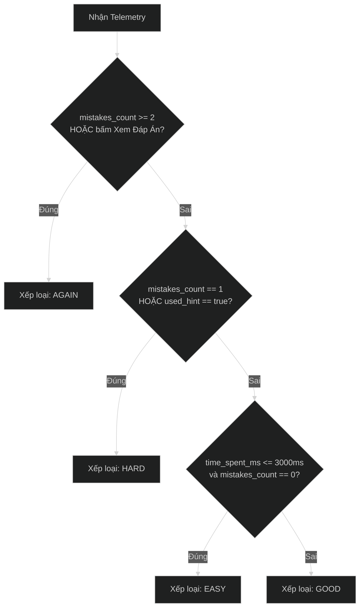

# Đặc Tả Kỹ Thuật Thuật Toán Spaced Repetition System (SRS)

Tài liệu này đặc tả chi tiết mô hình toán học, trạng thái chuyển đổi, cơ chế tự động đánh giá (Auto-Grading Telemetry) và giải thuật phân bổ bài tập của hệ thống **Spaced Repetition System (SRS)** cho ứng dụng học từ vựng Sync_Flow.

---

## 1. Tổng Quan & Mục Tiêu Kỹ Thuật

Thuật toán SRS được xây dựng nhằm mục tiêu tối ưu hóa khả năng ghi nhớ dài hạn (Long-Term Retention) theo đường cong quên lãng Ebbinghaus (Forgetting Curve), kết hợp với mô hình học tập chủ động 3 cấp độ (Active Recall $\rightarrow$ Sentence Builder $\rightarrow$ Active Production).

### Các Nguyên Lý Cốt Lõi:
1. **Kế thừa & Cải tiến SM-2 (Modified Anki SM-2)**: Sử dụng hệ số độ dễ (Ease Factor - $EF$), số lần lặp ($Repetition$), và khoảng cách ngày ($Interval$).
2. **Auto-Grading Telemetry**: Tự động chuyển đổi hành vi tương tác thực tế của người học (thời gian phản xạ, số lần chọn sai, số lần dùng gợi ý) thành điểm đánh giá SRS khách quan.
3. **Atomic Multi-Sense Round-Robin**: Giữ nguyên 1 thẻ cho từ vựng nhưng xoay vòng các bài tập câu tương ứng với từng nghĩa tiếng Việt qua các chu kỳ ôn tập.
4. **Leech Detection & Adaptive Intervention**: Nhận diện thẻ khó (quên $\ge 5$ lần) để kích hoạt cơ chế can thiệp nhận thức thay vì để người học học vẹt.
5. **Fuzzing Anti-Clustering**: Chống dồn toa thẻ ôn tập vào cùng một ngày trong tương lai.

---

## 2. Mô Hình Toán Học & Công Thức Tính Toán SRS

### 2.1. Các Biến Trạng Thái Của Thẻ (`USER_CARD_PROGRESS`)

| Ký Hiệu | Trường Database | Kiểu Dữ Liệu | Giá Trị Mặc Định | Ý Nghĩa |
| :--- | :--- | :--- | :--- | :--- |
| $S$ | `state` | `VARCHAR(20)` | `'new'` | Trạng thái thẻ: `new`, `learning`, `review`, `mastered` |
| $L$ | `mastery_level` | `INT` | `1` | Cấp độ thành thạo tương tác ($1 \le L \le 3$) |
| $EF$ | `ease_factor` | `NUMERIC(4,2)` | `2.50` | Hệ số độ dễ (Ease Factor), $1.30 \le EF \le 3.50$ |
| $I$ | `interval_days` | `INT` | `0` | Khoảng cách ngày đến lần ôn tập tiếp theo |
| $R$ | `repetition_count` | `INT` | `0` | Số lần ôn tập thành công liên tiếp |
| $Lapses$ | `lapses_count` | `INT` | `0` | Tổng số lần bị quên thẻ (chấm `Again`) |
| $Idx$ | `last_exercise_index`| `INT` | `0` | Vị trí index bài tập câu làm gần nhất |
| $Due$ | `due_date` | `TIMESTAMPTZ` | `NOW()` | Thời điểm tới hạn ôn tập |

---

### 2.2. Bảng Công Thức Cập Nhật Trạng Thái Theo 4 Mức Đánh Giá (Rating)

Khi người học hoàn thành bài tập, hệ thống xác định 1 trong 4 mức rating: `Again`, `Hard`, `Good`, `Easy`.

#### 1. Mức `Again` (Quên / Làm sai nhiều)
* **Ease Factor**:
  $$EF' = \max(1.30, EF - 0.20)$$
* **Interval**:
  $$I' = 0 \text{ hoặc } 1 \text{ ngày (lặp lại ngay sau 1–10 phút trong ngày)}$$
* **Repetition Count**:
  $$R' = 0$$
* **Mastery Level**:
  $$L' = 1 \text{ (giáng cấp về lật thẻ Flashcard)}$$
* **Lapses Count**:
  $$Lapses' = Lapses + 1$$
* **Next Due Date**:
  $$Due' = NOW() + 10 \text{ minutes}$$

---

#### 2. Mức `Hard` (Nhớ khó khăn / Mất nhiều thời gian / Dùng gợi ý)
* **Ease Factor**:
  $$EF' = \max(1.30, EF - 0.15)$$
* **Interval**:
  $$I' = \begin{cases} 1 & \text{nếu } I = 0 \\ \max(1, \text{round}(I \times 1.20)) & \text{nếu } I \ge 1 \end{cases}$$
* **Repetition Count**:
  $$R' = R + 1$$
* **Mastery Level**:
  $$L' = L \text{ (giữ nguyên level hiện tại)}$$
* **Next Due Date**:
  $$Due' = NOW() + I' \text{ days}$$

---

#### 3. Mức `Good` (Ghi nhớ đạt chuẩn / Tốc độ phản xạ tiêu chuẩn)
* **Ease Factor**:
  $$EF' = EF \text{ (giữ nguyên độ dễ)}$$
* **Interval**:
  $$I' = \begin{cases} 1 & \text{nếu } R = 0 \\ 6 & \text{nếu } R = 1 \\ \text{round}(I \times EF) & \text{nếu } R \ge 2 \end{cases}$$
* **Repetition Count**:
  $$R' = R + 1$$
* **Mastery Level**:
  $$L' = \min(3, L + 1) \text{ (thăng cấp kỹ năng)}$$
* **Next Due Date**:
  $$Due' = NOW() + \text{Fuzz}(I') \text{ days}$$

---

#### 4. Mức `Easy` (Nhớ rất tốt / Phản xạ cực nhanh $\le 3000ms$)
* **Ease Factor**:
  $$EF' = \min(3.50, EF + 0.15)$$
* **Interval**:
  $$I' = \begin{cases} 4 & \text{nếu } R = 0 \\ \text{round}(I \times EF \times 1.30) & \text{nếu } R \ge 1 \end{cases}$$
* **Repetition Count**:
  $$R' = R + 1$$
* **Mastery Level**:
  $$L' = 3 \text{ (nhảy thẳng lên Level 3)}$$
* **Next Due Date**:
  $$Due' = NOW() + \text{Fuzz}(I') \text{ days}$$

---

### 2.3. Thuật Toán Fuzzing Chống Dồn Toa (Anti-Clustering Fuzzing)

Để tránh hiện tượng người học học nhiều thẻ trong 1 ngày dẫn đến các ngày trong tương lai bị dồn hàng trăm thẻ cùng lúc, ta áp dụng hệ số làm mờ ngẫu nhiên (Fuzzing Factor) khi $I' \ge 3$:

$$\text{Fuzz}(I') = \text{round}\Big(I' \times \big(1 + \text{UniformRandom}(-0.05, +0.05)\big)\Big)$$

*Ví dụ:* Nếu $I' = 30$ ngày, sau khi Fuzz khoảng cách thực tế sẽ dao động từ $29 \rightarrow 32$ ngày.

---

## 3. Ma Trận Quy Đổi Telemetry Sang SRS Rating (Auto-Grading Engine)

Ở Level 2 (Sentence Builder) và Level 3 (Gõ từ vựng), client gửi telemetry về backend gồm:
- `time_spent_ms` (thời gian làm bài tính bằng mili-giây).
- `mistakes_count` (số lần chọn sai token / gõ sai ký tự).
- `used_hint` (cờ boolean người học có bấm xem gợi ý nghĩa/ngữ cảnh hay không).



### Bảng Ma Trận Đánh Giá:

| Điều Kiện Telemetry | Rating Đầu Ra | Ý Nghĩa Nhận Thức |
| :--- | :--- | :--- |
| `mistakes_count >= 2` HOẶC Bấm xem đáp án | **`AGAIN`** | Chưa thuộc từ vựng / Quên hoàn toàn cấu trúc câu. |
| `mistakes_count == 1` HOẶC `used_hint == true` | **`HARD`** | Nhận biết còn ngập ngừng, cần sự trợ giúp từ hệ thống. |
| `mistakes_count == 0` VÀ `time_spent_ms <= 3000ms` | **`EASY`** | Phản xạ tự nhiên tức thì, từ vựng đã trở thành phản xạ vô điều kiện. |
| `mistakes_count == 0` VÀ `time_spent_ms > 3000ms` | **`GOOD`** | Ghi nhớ chính xác theo tiêu chuẩn. |

---

## 4. Giải Thuật Phân Bổ Bài Tập Đa Nghĩa (Multi-Sense Round-Robin)

Mỗi thẻ `VOCAB_CARDS` có mảng $N$ câu bài tập trong `CARD_EXERCISES` ($N \ge 1$), mỗi câu tương ứng 1 nghĩa tiếng Việt.

### 4.1. Công Thức Chọn Bài Tập Tiếp Theo:
Khi API `/api/v1/study/queue` nạp bài tập cho thẻ:
$$\text{selected\_index} = (\text{last\_exercise\_index} + 1) \pmod{N}$$

### 4.2. Cập Nhật Khi Submit:
Khi người học nộp bài thành công:
$$\text{last\_exercise\_index} = \text{selected\_index}$$

*Lợi ích:* Đảm bảo qua mỗi chu kỳ SRS (ví dụ: ngày 1 ôn nghĩa 1, ngày 6 ôn nghĩa 2, ngày 15 ôn nghĩa 3), người học được củng cố toàn diện mọi sắc thái nghĩa của từ mà không bị nhàm chán.

---

## 5. Cơ Chế Leech Detection & Adaptive Learning

Dựa trên nguyên lý **Leech Threshold của Anki**:

$$\text{IsLeech}(card) = (lapses\_count \ge 5)$$

Khi một thẻ trở thành Leech Card:
1. **Gắn nhãn hệ thống**: Set flag `is_leech: true` trong API payload trả về cho App.
2. **Hiển thị Mnemonic Clue**: Client tự động mở phần "Mẹo ghi nhớ" hoặc "Hình ảnh minh họa" ở mặt trước của thẻ.
3. **Ưu tiên bài tập câu ngắn**: Engine tự động chọn bài tập có `target_sentence` ngắn nhất và không nạp `distractor_tokens` để giảm tải nhận thức.

---

## 6. Đặc Tả Giao Diện Lập Trình API (API Contracts)

### 6.1. `GET /api/v1/study/queue`
Lấy danh sách các thẻ tới hạn ôn tập kèm payload bài tập tương ứng với `mastery_level`.

* **Request Query Params**:
  - `limit`: Số lượng thẻ tối đa (mặc định 20, max 50).
  - `deck_id`: (Optional) Lọc theo bộ thẻ cụ thể.
  - `cefr_level`: (Optional) Lọc theo cấp độ CEFR cụ thể (ví dụ: `B1`, `B2`).
  - `tag_id`: (Optional) Lọc theo nhãn cụ thể (ví dụ: `#collocation`, `#interview`).

* **Response (200 OK)**:
```json
{
  "total_due": 15,
  "queue": [
    {
      "card_id": "card_01J8F...",
      "term": "run",
      "phonetic": "/rʌn/",
      "audio_url": "https://cdn.example.com/audio/run.mp3",
      "mastery_level": 2,
      "state": "review",
      "lapses_count": 1,
      "is_leech": false,
      "meanings": [
        {
          "order": 1,
          "pos": "verb",
          "meaning_vi": "vận hành, quản lý",
          "definition_en": "to manage or be in charge of",
          "example_en": "She runs a coffee shop.",
          "example_vi": "Cô ấy điều hành quán cà phê."
        },
        {
          "order": 2,
          "pos": "verb",
          "meaning_vi": "chạy bộ",
          "definition_en": "to move fast using feet",
          "example_en": "He runs 5km daily.",
          "example_vi": "Anh ấy chạy 5km mỗi ngày."
        }
      ],
      "current_exercise": {
        "id": "ex_01J8F...",
        "exercise_type": "sentence_builder",
        "meaning_hint": "vận hành, quản lý",
        "target_sentence": "She runs a profitable coffee shop.",
        "vietnamese_translation": "Cô ấy điều hành một quán cà phê sinh lời.",
        "tokens": ["She", "runs", "a", "profitable", "coffee", "shop."],
        "distractor_tokens": ["walks", "sells"],
        "target_index": 1,
        "audio_url": "https://cdn.example.com/audio/run_ex1.mp3"
      }
    }
  ]
}
```

---

### 6.2. `POST /api/v1/study/submit`
Nộp kết quả làm bài tập và tính toán chu kỳ SRS mới.

* **Request Body**:
```json
{
  "card_id": "card_01J8F...",
  "mastery_level": 2,
  "time_spent_ms": 2850,
  "mistakes_count": 0,
  "used_hint": false,
  "manual_rating": null
}
```
> *Lưu ý:* `manual_rating` chỉ gửi lên khi ở Level 1 (Flashcard: người học tự bấm `again|hard|good|easy`). Ở Level 2 & Level 3, `manual_rating` để `null`, backend sẽ tự động chạy Auto-Grading Telemetry Engine.

* **Response (200 OK)**:
```json
{
  "card_id": "card_01J8F...",
  "evaluated_rating": "easy",
  "previous_level": 2,
  "new_level": 3,
  "previous_interval": 6,
  "new_interval": 19,
  "ease_factor": 2.65,
  "due_date": "2026-10-22T11:00:00Z",
  "is_leech": false
}
```

---

## 7. Triển Khai Mẫu Thuật Toán (Reference Implementation in Go)

```go
package srs

import (
	"math"
	"math/rand"
	"time"
)

type Rating string

const (
	RatingAgain Rating = "again"
	RatingHard  Rating = "hard"
	RatingGood  Rating = "good"
	RatingEasy  Rating = "easy"
)

type Telemetry struct {
	TimeSpentMs   int
	MistakesCount int
	UsedHint      bool
	ManualRating  *Rating
}

type CardProgress struct {
	MasteryLevel      int
	EaseFactor        float64
	IntervalDays      int
	RepetitionCount   int
	LapsesCount       int
	LastExerciseIndex int
	DueDate           time.Time
}

type SRSResult struct {
	Rating       Rating
	NewLevel     int
	NewEF        float64
	NewInterval  int
	NewDueDate   time.Time
	NewLapses    int
	NewRepCount  int
	IsLeech      bool
}

// EvaluateTelemetry map các chỉ số tương tác sang Rating
func EvaluateTelemetry(t Telemetry, currentLevel int) Rating {
	if t.ManualRating != nil {
		return *t.ManualRating
	}
	if t.MistakesCount >= 2 {
		return RatingAgain
	}
	if t.MistakesCount == 1 || t.UsedHint {
		return RatingHard
	}
	if t.TimeSpentMs <= 3000 && t.MistakesCount == 0 {
		return RatingEasy
	}
	return RatingGood
}

// CalculateSRS tính toán trạng thái tiếp theo của thẻ
func CalculateSRS(p CardProgress, t Telemetry) SRSResult {
	rating := EvaluateTelemetry(t, p.MasteryLevel)
	
	ef := p.EaseFactor
	if ef < 1.30 {
		ef = 2.50
	}

	var newLevel int
	var newEF float64
	var newInterval int
	var newReps int
	var newLapses = p.LapsesCount
	now := time.Now()
	var newDueDate time.Time

	switch rating {
	case RatingAgain:
		newEF = math.Max(1.30, ef-0.20)
		newInterval = 0
		newReps = 0
		newLevel = 1
		newLapses++
		newDueDate = now.Add(10 * time.Minute)

	case RatingHard:
		newEF = math.Max(1.30, ef-0.15)
		if p.IntervalDays == 0 {
			newInterval = 1
		} else {
			newInterval = int(math.Max(1, math.Round(float64(p.IntervalDays)*1.20)))
		}
		newReps = p.RepetitionCount + 1
		newLevel = p.MasteryLevel
		newDueDate = now.AddDate(0, 0, newInterval)

	case RatingGood:
		newEF = ef
		if p.RepetitionCount == 0 {
			newInterval = 1
		} else if p.RepetitionCount == 1 {
			newInterval = 6
		} else {
			newInterval = int(math.Round(float64(p.IntervalDays) * ef))
		}
		newInterval = applyFuzz(newInterval)
		newReps = p.RepetitionCount + 1
		newLevel = int(math.Min(3, float64(p.MasteryLevel+1)))
		newDueDate = now.AddDate(0, 0, newInterval)

	case RatingEasy:
		newEF = math.Min(3.50, ef+0.15)
		if p.RepetitionCount == 0 {
			newInterval = 4
		} else {
			newInterval = int(math.Round(float64(p.IntervalDays) * ef * 1.30))
		}
		newInterval = applyFuzz(newInterval)
		newReps = p.RepetitionCount + 1
		newLevel = 3
		newDueDate = now.AddDate(0, 0, newInterval)
	}

	return SRSResult{
		Rating:      rating,
		NewLevel:    newLevel,
		NewEF:       math.Round(newEF*100) / 100,
		NewInterval: newInterval,
		NewDueDate:  newDueDate,
		NewLapses:   newLapses,
		NewRepCount: newReps,
		IsLeech:     newLapses >= 5,
	}
}

// applyFuzz thêm độ lệch ngẫu nhiên +/- 5% khi interval >= 3
func applyFuzz(interval int) int {
	if interval < 3 {
		return interval
	}
	fuzzRange := float64(interval) * 0.05
	delta := (rand.Float64()*2 - 1) * fuzzRange
	res := int(math.Round(float64(interval) + delta))
	if res < 1 {
		return 1
	}
	return res
}
```
